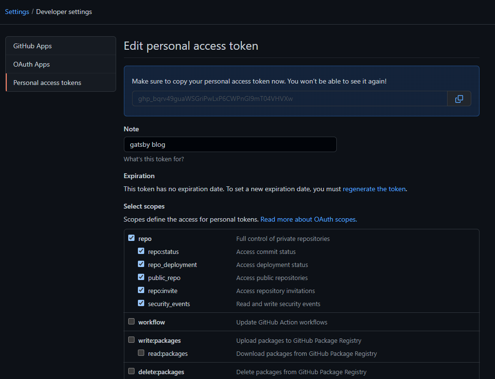
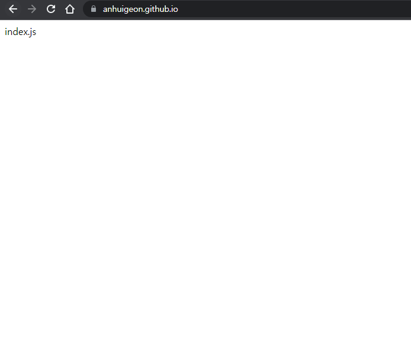
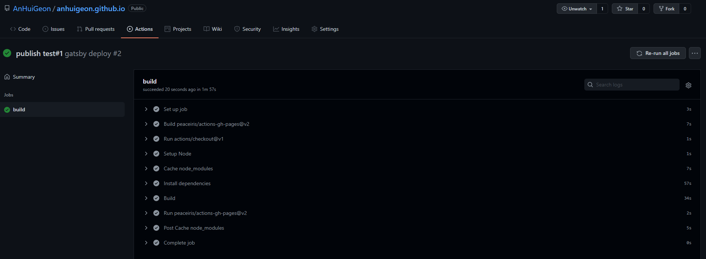
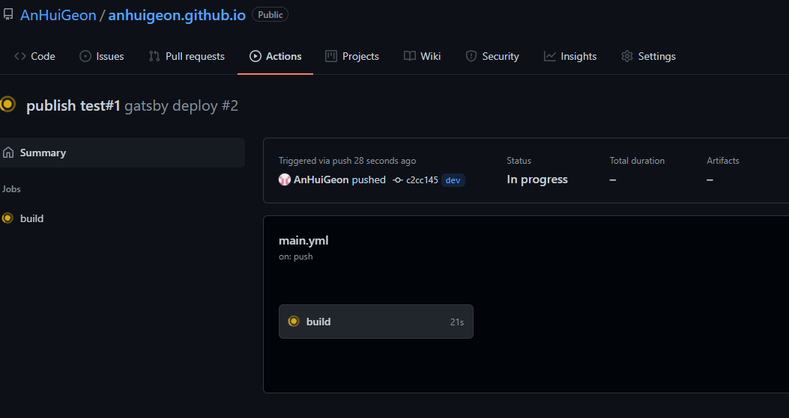

---
title: Gatsby 프로젝트 생성과 Github Action으로 자동배포 설정
date: 2021-11-11 00:00:00 +0300
description: # Add post description (optional)
img: ../../../images/gatsby-react.png # Add image post (optional)
tags: [Blog, Gatsby, JAM stack, Github Action] # add tag
categories: blog # add category
series: GatsbyBlog
---  
<br/>

## Gatsby 프로젝트 생성과 Github Action으로 자동배포 설정
cmd창을 열고 `npm init gatsby` 명령어를 입력하여 자신에게 필요한 항목을 체크하여 프로젝트를 생성합니다.

위 과정을 거치면 `./프로젝트명` 으로 프로젝트 폴더가 생성됩니다.
이제 github에 Repository를 생성하는데, Repository명은 블로그이름.github.io로 작성하고, git bash를 열어 방금 생성한 프로젝트 폴더로 이동하여 아래의 순서대로 입력합니다.

<br/>

git bash
```bash
  echo "# anhuigeon.github.io" >> README.md
  git init
  git add README.md
  git commit -m "[커밋 내용]"
  git branch -M main
  git remote add origin [레포지터리 URL]
  git push -u origin main
```

<br/>

이제 github에 첫번째 commit을 완료했습니다.

github action에 workflow를 생성하기 전, 우측 상단의 자신의 계정 아이콘을 클릭하고, Settings로 이동합니다.


그리고 Personal access tokens에서 token을 생성하고 복사해줍니다.


다시 아까 생성한 repo로 돌아와 Settings > Secrets > Dependabot으로 이동하여 New repository secret을 눌러 발급 받은 토큰을 입력합니다.



다음으로 github action에 workflow를 생성합니다.



Start commit 하면 아래와 같이 .yml파일이 생성됩니다.


다음으로는 git bash에서 pull하여 .yml 파일이 추가된 것을 확인하고 여러 작업을 한 뒤 push 하고 다시 git bash로 이동하여 아래의 명령어를 입력합니다.

git bash
```bash
  git branch dev
  git checkout dev
  git pull origin main
  code . -> vscode가 열립니다.
```

열린 vscode에 가보면 .github/workflows 폴더에 main.yml파일이 생성 된 것을 확인할 수 있습니다.
이제 메인 화면을 보여주는 index.js파일을 수정하고, main.yml을 본인에게 필요한 명령어를 입력해줍니다.

index.js

```javascript
  import * as React from "react"

  const IndexPage = () => {
    return (
      <div>
        index.js
      </div>
    )
  }

  export default IndexPage
```
```js
  import * as React from "react"

  const IndexPage = () => {
    return (
      <div>
        index.js
      </div>
    )
  }

  export default IndexPage
```
```jsx
  import * as React from "react"

  const IndexPage = () => {
    return (
      <div>
        index.js
      </div>
    )
  }

  export default IndexPage
```

<br/>

main.yml
```yml
  name: gatsby deploy

  on:
    push:
      branches:
        - dev

  jobs:
    build:
      runs-on: ubuntu-latest
      steps:
        - uses: actions/checkout@v1
        - name: Setup Node
          uses: actions/setup-node@v1
          with:
            node-version: '14.x'

        - name: Cache node_modules
          uses: actions/cache@v1
          with:
            path: node_modules
            key: ${{runner.OS}}-build-${{hashFiles('**/yarn.lock')}}
            restore-keys: |
              ${{ runner.OS }}-build-${{ runner.OS }}-

        - name: Install dependencies
          run: yarn install --prod --pure-lockfile
          
        - name: Build
          run: yarn build --prefix-paths
          env:
            NODE_ENV: production
        - uses: peaceiris/actions-gh-pages@v2
          env:
            GITHUB_TOKEN: ${{ secrets.GITHUB_TOKEN }}
            PUBLISH_BRANCH: main
            PUBLISH_DIR: ./public
```

<br/>

다시 git bash로 이동하여 아래의 명령어를 입력하면 github action에서 빌드를 수행합니다.

<br/>

git bash
```bash
  git add .
  git commit -m '커밋 내용'
  git push -u origin dev
```

<br/>




빌드가 모두 마치면, 이제 github action에 자신이 입력한 .yml파일이 gatsby프로젝트를 배포하여 https://[repo이름] 의 링크에서 아래와 같이 배포가 된 것을 확인할 수 있습니다.


이제 자유롭게 커스터마이징 하십시오!

<br/>

참고
github action 사용법 - [https://zzsza.github.io/development/2020/06/06/github-action/](https://zzsza.github.io/development/2020/06/06/github-action/)

<br/>